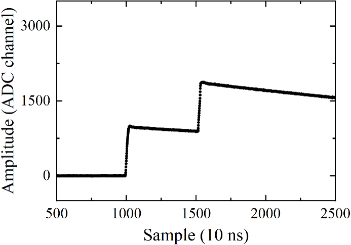

# Pile-up recovery algorithm
Based on CERN ROOT v6.16.00

## 1. Original waveform
The waveforms measured by the HPGe detector were digitized and recorded by 100-MHz 14-bit Pixie16 modules using the GDDAQ data acquisition framework, with each waveform 150 μs long (15000 samples).

The baseline amplitude was obtained by averaging the waveform samples within the baseline region (0-8 μs, corresponding to 0-800 sampling points), and the baseline was then corrected to zero. In addition, periodic noise present in the experimental waveforms, which would interfere with subsequent processing, was removed by subtracting a noise waveform extracted from signal-free events.

```cpp
std::vector<float> wave; // original waveform
std::vector<float> base_line; // periodic noise waveform extracted from signal-free events
static const int nbase = 800; // length of baseline region
double base = 0;
for (int ipnt = 0; ipnt < nbase; ipnt++) {
   	base += wave[ipnt] / nbase;
}

TGraph* gwave = new TGraph;
int gpnt = 0;
for (int ipnt = 0; ipnt < int(wave.size()); ipnt++) {
   	wave[ipnt] = wave[ipnt] - base;
   	wave[ipnt] = wave[ipnt] - base_line.at(ipnt);
gwave->SetPoint(gpnt, gpnt, wave[ipnt]);
gpnt++;
}
```

