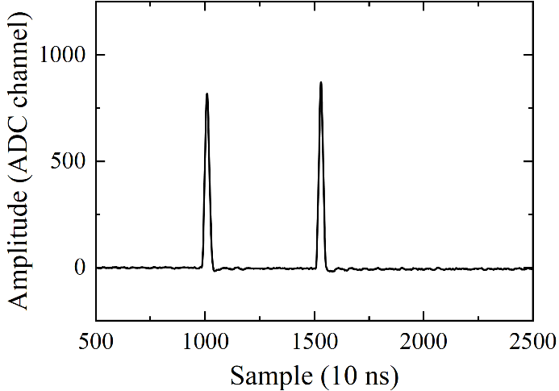
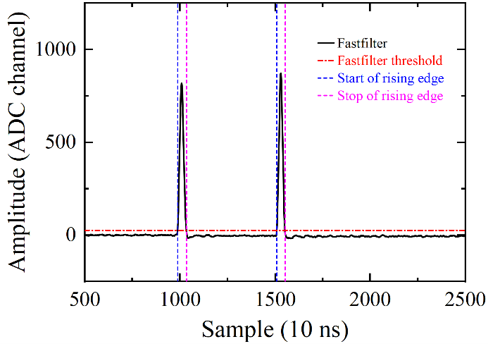
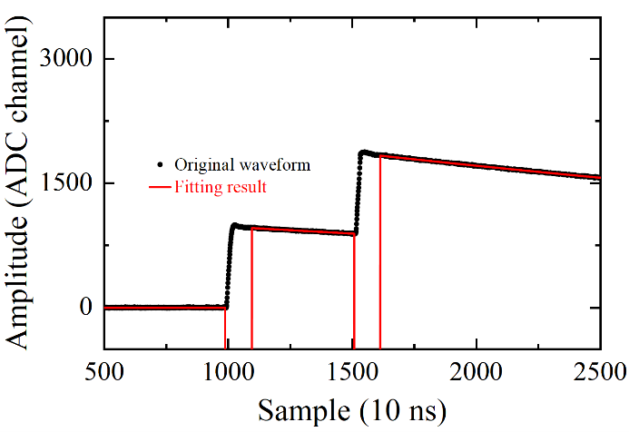
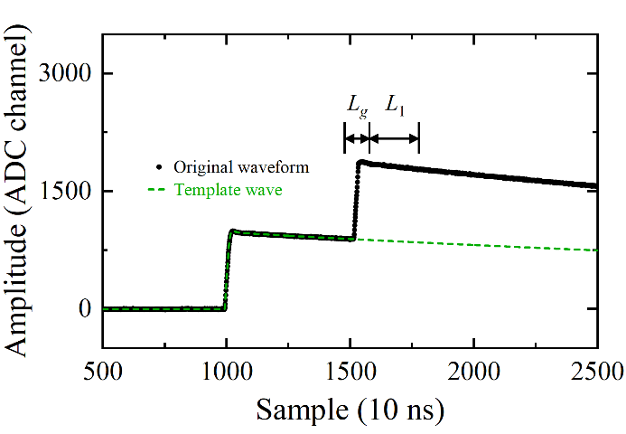

# Pile-up recovery algorithm
Based on CERN ROOT v6.16.00

## 1. Original waveform
The waveforms measured by the HPGe detector were digitized and recorded by 100-MHz 14-bit Pixie16 modules using the GDDAQ data acquisition framework, with each waveform 150 μs long (15000 samples).

The baseline amplitude was obtained by averaging the waveform samples within the baseline region (0-8 μs, corresponding to 0-800 sampling points), and the baseline was then corrected to zero. In addition, periodic noise present in the experimental waveforms, which would interfere with subsequent processing, was removed by subtracting a noise waveform extracted from signal-free events.

```cpp
std::vector<float> wave; // original waveform
std::vector<float> base_line; // periodic noise waveform extracted from signal-free events
static const int nbase = 800; // length of baseline region
double base = 0;
for (int ipnt = 0; ipnt < nbase; ipnt++) {
   	base += wave[ipnt] / nbase;
}

TGraph* gwave = new TGraph;
int gpnt = 0;
for (int ipnt = 0; ipnt < int(wave.size()); ipnt++) {
   	wave[ipnt] = wave[ipnt] - base;
   	wave[ipnt] = wave[ipnt] - base_line.at(ipnt);
gwave->SetPoint(gpnt, gpnt, wave[ipnt]);
gpnt++;
}
```


## 2. Fast-filter signal
A trapezoidal filtering algorithm converts the waveform into the fast-filter signal to determine pulse triggers.

```cpp
std::vector<float> vfastfilter;
static const int L = 10; // fastfilter parameter
for (int ipnt = 0; ipnt < gwave->GetN(); ipnt++) {
    float fastfilter = 0;
    if (ipnt >= 2 * L && ipnt <= gwave->GetN() - L) {
        for (int jpnt = 0; jpnt < L; jpnt++) {
            double x1 = 0;
            double y1 = 0;
            double x2 = 0;
            double y2 = 0;
            gwave->GetPoint(ipnt + jpnt, x1, y1);
            gwave->GetPoint(ipnt - 2 * L + jpnt, x2, y2);
            fastfilter += y1 - y2;
        }
        fastfilter /= L;
    }
    vfastfilter.push_back(fastfilter);
}
```



## 3. Find rising-edge
To avoid false triggers, it is required that the sample immediately before the rising-edge start point a has an amplitude no greater than the threshold, and that the L samples immediately before the rising-edge end point b all have amplitudes no less than the threshold. The rising-edge interval [a, b] is recorded for each signal and the samples within the interval are excluded from the subsequent fitting process. 

In addition, since the region immediately after the rising edge exhibits significant fluctuations, a delay time D1 is introduced, and the samples from b to b+D1 are also excluded to improve the fitting accuracy.

```cpp
std::vector<int> vrejpnts; //discarded samples 
std::vector<int> vposl, vposr, vhl, vhr; //positions and amplitudes of the rising-edge start points and end points
bool rise = false; // indicate whether the current sample lies on the rising edge.
int count = 0; //length of the rising edge
bool is_not_peak = 0;// Triggered by noise
bool is_double_peak = 0;// Overlapping in the rising edge and identified as a single trigger
for (int ipnt = nbase; ipnt <= gwave->GetN() - L; ipnt++) {
    if (!rise && vfastfilter[ipnt] >= thres) {
        bool is_signal_start = 1;
        if (vfastfilter[ipnt - 1] > thres) {
            is_signal_start = 0;
        }

        if (is_signal_start) {
            rise = true;
            vposl.push_back(ipnt);
            double x1 = -9999;
            double y1 = -9999;
            gwave->GetPoint(ipnt, x1, y1);
            vhl.push_back(y1);
        }
    }

    if (rise && vfastfilter[ipnt] <= thres) {
        bool is_signal_stop = 1;
        if (vfastfilter[ipnt - 1] < thres) {
            is_signal_stop = 0;
        }

        for (int jpnt = 1; jpnt <= 1 * L; jpnt++) {
            if (vfastfilter[ipnt - jpnt] < thres) {
                is_not_peak = 1;
                break;
            }
        }

        if (is_signal_stop) {
            is_double_peak = 0;
            rise = false;
            count = 0;
            vposr.push_back(ipnt);
            double x1 = -9999;
            double y1 = -9999;
            gwave->GetPoint(ipnt, x1, y1);
            vhr.push_back(y1);

            if (is_not_peak) {// discard signals triggered by noises
                vposr.pop_back();
                vhr.pop_back();
                vposl.pop_back();
                vhl.pop_back();
                is_not_peak = 0;
            }
        }
    }
if (rise) {
vrejpnts.push_back(ipnt);// discard samples of the rising edge
    	count++;
}
}

const int fit_range_delay = 60;// discard samples from b to b+D1 to improve the fitting accuracy
int npeaks = vposr.size(); //total number of signals
for (int ipeak = 0; ipeak < npeaks; ipeak++) {
    for (int ipnt = vposr[ipeak]; ipnt <= vposr[ipeak] + fit_range_delay; ipnt++) {
        vrejpnts.push_back(ipnt);
    }
}
```



## 4. Find arrival time
The signal arrival time t is determined based by applying CFD to the fast-filter signal.. For signals whose arrival time cannot be successfully determined, a special value is assigned, and these signals are discarded in subsequent processing.

```cpp
std::vector<int> vposCFD;// signal arrival time determined by CFD
int CFD_D = 5;// CFD parameter
double CFD_f = 0.25;// CFD parameter
for (int ipeak = 0; ipeak < npeaks; ipeak++) {
    std::vector<double> f_points;// CFD wave

    bool find_CFD = 0;
    for (int ipnt = vposl[ipeak]; ipnt < vposr[ipeak]; ipnt++) { //search arrival time in [a,b]
        double x1 = vfastfilter[ipnt];
        if (ipnt - CFD_D < 0) {
            continue;
        }
        double x2 = vfastfilter[ipnt - CFD_D];
        double y = CFD_f * x1 - x2;
        f_points.push_back(y);

        if (f_points.at(f_points.size() - 1) < 0 && f_points.size() > 1) {
            if (f_points.at(f_points.size() - 2) > 0 || f_points.at(f_points.size() - 2) == 0) {
                vposCFD.push_back(ipnt);
                find_CFD = 1;
                break;
            }
        }
    }

    if (!find_CFD) { //if cannot find arrival time in [a,b], then search arrival time in [a,a-L]
        std::vector<double> f_points_new; // CFD wave
        for (int ipnt = vposl[ipeak]; ipnt >= vposl[ipeak] - L; ipnt--) {
            if (ipnt < 0 || ipnt - CFD_D < 0) {
                continue;
            }

            double x1 = vfastfilter[ipnt];
            double x2 = vfastfilter[ipnt - CFD_D];
            double y = CFD_f * x1 - x2;
            f_points_new.push_back(y);

            if (f_points_new.at(f_points_new.size() - 1) > 0 && f_points_new.size() > 1) {
                if (f_points_new.at(f_points_new.size() - 2) < 0 || f_points_new.at(f_points_new.size() - 2) == 0) {
                    vposCFD.push_back(ipnt - 1);
                    find_CFD = 1;
                    break;
                }
            }
        }
    }

    if (!find_CFD) {
        vposCFD.push_back(-9999); //cannot find arrival time, discard this signal later
    }
}
```

## 5. Fitting
A multi-exponential function is used to fit the decay tails of individual pulses within a pile-up waveform to determine their amplitudes.

```cpp
// fit function
double ffit(double* val, double* par)
{
    double x0 = val[0];
    int npeaks = par[0];// number of peaks

    //discard the rising edges
    for (int rejpnt : vrejpnts) {
        if (abs(x0 - rejpnt) < 1) {
            TF1::RejectPoint();
            return rejval;
        }
    }

    double wave = 0;
    for (int ipeak = 0; ipeak < npeaks; ipeak++) {
        double A = par[3 * ipeak + 1];// amplitude of the peak
        double pos = par[3 * ipeak + 2];// position of the peak
        double lambda = par[3 * ipeak + 3];

        double temp = x0 - pos;

        if (temp >= 0) {
            wave += A * TMath::Exp(-lambda * temp);
        }
        else {
            wave += 0;
        }
    }
    return wave;
}

const double tau = 5650;// decay time constant
const double lambda_decay = 1.0 / tau;
TF1* f = new TF1("f", ffit, 0, gwave->GetN() - 1, 3 * npeaks + 1);
f->SetNpx(gwave->GetN());
TFitResultPtr fr;

// set initial values for the fitting parameters
f->FixParameter(0, npeaks);
for (int ipeak = 0; ipeak < npeaks; ipeak++) {
    f->SetParameter(3 * ipeak + 1, vhr[ipeak] - vhl[ipeak]);
    f->SetParLimits(3 * ipeak + 1, (vhr[ipeak] - vhl[ipeak]) * 0.5, (vhr[ipeak] - vhl[ipeak]) * 6.0);

    f->SetParameter(3 * ipeak + 2, (vposr[ipeak] + vposl[ipeak]) / 2.);
    f->SetParLimits(3 * ipeak + 2, vposl[ipeak], vposr[ipeak]);

    f->FixParameter(3 * ipeak + 3, lambda_decay); // fix decay time constant
}

fr = gwave->Fit(f, "SQR+", "", 0, gwave->GetN() - 1);// fit the waveform using a superposition of multiple exponential functions
```



## 6. Find the maximum point 
The maximum point of each signal within its rising-edge interval is found and used to shift the template waveform in subsequent processing.

```cpp
std::vector<int> vpos_high, vh_high; //rising-edge maximum points and their amplitudes
for (int ipeak = 0; ipeak < npeaks; ipeak++) {
    std::vector<std::pair<double, double>> points;
    for (int ipnt = vposl[ipeak]; ipnt < vposr[ipeak]; ipnt++) {
        double x1 = ipnt;
        double y1 = wave[ipnt];
        points.push_back(std::make_pair(x1, y1));
    }

    auto maxIt = std::max_element(points.begin(), points.end(),
        [](const std::pair<double, double>& a, const std::pair<double, double>& b) {
            return a.second < b.second; 
        });

    double xOfMaxY = -10000;
    double maxY = -99999;
    if (maxIt != points.end()) {
        xOfMaxY = maxIt->first;
        maxY = maxIt->second;
    }

    vpos_high.push_back(xOfMaxY);
    vh_high.push_back(maxY);
}
```

## 7. Calculate the area of each signal
Using the amplitudes from the exponential fitting and the positions of the maximum points, the template waveform is scaled and shifted to match each corresponding pulse in amplitude and position. Another delay time D2 is introduced here to avoid possible effects of the fluctuation immediately after the rising edge on the amplitude scaling. By superimposing multiple template waveforms, the combined waveform of all pile-up pulses preceding a given pulse is constructed, thereby subtracting their contributions in the regions used for calculating the area of the current pulse. 

```cpp
TGraph g_temp; //template waveform
Int_t g_temp_max_x = 1236; //maximum point of the template waveform
Int_t ibase = 400;// delay time D2 to avoid possible effects of the fluctuation immediately after the rising edge on the amplitude scaling
Int_t i_base_new = g_temp_max_x + ibase; // the reference point used to scale the template waveform

// load and normalized the template waveform relative to the reference point
void Set_template_wave() {
    std::ifstream ift_temp_wave{};
    Int_t temp_wave_length = 0;
    Double_t A_temp[15000];
    Double_t T_temp[15000];
    while (!ift_temp_wave.eof()) {
        ift_temp_wave >> T_temp[temp_wave_length];
        ift_temp_wave >> A_temp[temp_wave_length];
        temp_wave_length++;
    }

    Double_t A_temp0 = A_temp[i_base_new];
    for (Int_t i = 0; i < temp_wave_length; i++) {
        Double_t A_temp_new = A_temp[i] / A_temp0;
        g_temp.SetPoint(i, T_temp[i], A_temp_new);
    }
}

//the single exponential function of the jth pulse
double ffit_single(double* val, double* par)
{
    double x0 = val[0];
    int npeaks = par[0];

    double wave = 0;
    for (int ipeak = 0; ipeak < npeaks; ipeak++) {
        double A = par[3 * ipeak + 1];
        double pos = par[3 * ipeak + 2];
        double lambda = par[3 * ipeak + 3];

        double temp = x0 - pos;
        if (temp >= 0) {
            wave += A * TMath::Exp(-lambda * temp);
        }
        else {
            wave += 0;
        }
    }
    return wave;
}

//the function of multiple template waveforms
double fwave_temp(double* val, double* par)
{
    double x0 = val[0];
    int npeaks = par[0];

    double wave = 0;
    for (int ipeak = 0; ipeak < npeaks; ipeak++) {
        double A = par[2 * ipeak + 1];
        double pos = par[2 * ipeak + 2];

        double temp = x0 - pos;
        if (temp >= 0) {
            wave += A * g_temp.Eval(temp);
        }
        else {
            wave += 0;
        }
    }
    return wave;
}

std::vector<double> Ewave;// energies of signals

for (int ipeak = 0; ipeak < npeaks; ipeak++) {
    Int_t tleft = vposl[ipeak];
    //Whether each signal can be used for area calculation is determined as follows:
    //for the first signal
    if (ipeak == 0) {
        //if the interval between the signal and the end of the waveform is shorter than L1 + 0.7Lg, the remaining length is insufficient for area calculation, and the current signal is discarded
        if (abs(14999 - tleft) <= (L1 + 0.7 * Lg)) {
            continue;
        }

        //if there are at least two signals, the interval between the first and second signals is examined
        if (ipeak < npeaks - 1) {
            int tl_next = vposl[ipeak + 1];
            //if this interval is less than Lg, the two signals overlap on their rising edges, and the current signal is discarded
            if (abs(tl_next - tleft) <= Lg) {
                continue;
            }

            //if the interval lies between Lg and Lg + L1, the rising edge of the next signal falls within the L1 region of the current signal, and the current signal is discarded
            if (abs(tl_next - tleft) > Lg && abs(tl_next - tleft) <= (L1 + Lg)) {
                continue;
            }
        }
    }

    //for the second through the penultimate signal
    if (ipeak > 0 && ipeak < npeaks - 1) {
        //if the remaining length is insufficient for area calculation, the current signal is discarded
        if (abs(14999 - tleft) <= (L1 + 0.7 * Lg)) {
            continue;
        }

        //evaluate the the interval to the preceding signal
        int tl_last = vposl[ipeak - 1];
        //if the two signals overlap on their rising edges, the current signal is discarded
        if (abs(tl_last - tleft) <= Lg) {
            continue;
        }

        //evaluate the the interval to the following signal
        if (ipeak < npeaks - 1) {
            int tl_next = vposl[ipeak + 1];
            //if the two signals overlap on their rising edges, the current signal is discarded
            if (abs(tl_next - tleft) <= Lg) {
                continue;
            }

            //if the rising edge of the next signal falls within the L1 region of the current signal, the current signal is discarded
            if (abs(tl_next - tleft) > Lg && abs(tl_next - tleft) <= (L1 + Lg)) {
                continue;
            }
        }
    }

    //for the last signal
    if (ipeak > 0 && ipeak == npeaks - 1) {
        //if the remaining length is insufficient for area calculation, the current signal is discarded
        if (abs(14999 - tleft) <= (L1 + 0.7 * Lg)) {
            continue;
        }

        //evaluate the the interval to the preceding signal
        int tl_last = vposl[ipeak - 1];
        //if the two signals overlap on their rising edges, the current signal is discarded
        if (abs(tl_last - tleft) <= Lg) {
            continue;
        }
    }

    //regions used to calculate area of the signal
    Int_t Lg = 100;
    Int_t L1 = 200;
    Int_t Lg_start = tleft - 0.3 * Lg;
    Int_t Lg_stop = tleft + 0.7 * Lg - 1;
    Int_t L1_start = tleft + 0.7 * Lg;
    Int_t L1_stop = tleft + 0.7 * Lg + L1 - 1;

    //areas and backgrounds of the two regions
    Double_t Sg = 0;
    Double_t S1 = 0;
    Double_t Bg = 0;
    Double_t B1 = 0;

    Double_t parameter_b = exp(-1 * lambda_decay);// parameter used to integrate area

    //integrate the areas of the two regions 
    for (int iwaveg = Lg_start; iwaveg <= Lg_stop; iwaveg++) {
        Double_t x1 = -9999;
        Double_t y1 = -9999;
        gwave->GetPoint(iwaveg, x1, y1);
        Sg = Sg + y1;
    }

    for (int iwave1 = L1_start; iwave1 <= L1_stop; iwave1++) {
        Double_t x1 = -9999;
        Double_t y1 = -9999;
        gwave->GetPoint(iwave1, x1, y1);
        S1 = S1 + y1;
    }

    //subtract the tails of all preceding pulses
    if (ipeak > 0) {
        //construct the combined waveform of all pile-up pulses preceding a given pulse
        TF1* f_wave = new TF1("f_wave", fwave_temp, 0, gwave->GetN() - 1, 2 * ipeak + 1);
        f_wave->SetNpx(gwave->GetN());
        f_wave->FixParameter(0, ipeak);// there are i signals before the ith signal

        for (int jpeak = 0; jpeak < ipeak; jpeak++) {
            //construct the exponential function of the jth pulse
            TF1* f_fit_single = new TF1("f_fit_single", ffit_single, 0, gwave->GetN() - 1, 4);
            f_fit_single->SetNpx(gwave->GetN());
            //fix parameters using the fitting results
            f_fit_single->FixParameter(0, 1);
            f_fit_single->FixParameter(1, f->GetParameter(3 * jpeak + 1));
            f_fit_single->FixParameter(2, f->GetParameter(3 * jpeak + 2));
            f_fit_single->FixParameter(3, lambda_decay);

            Int_t tright_j = vposr[jpeak];
            if (vpos_high[jpeak] <= vposr[jpeak] && vpos_high[jpeak] >= vposl[jpeak]) {
                tright_j = vpos_high[jpeak];//use the position of the maximum point of the jth pulse to shift the template waveform 
            }

            Int_t ifit = tright_j + ibase;// the reference point used to scale the template waveform
            Double_t x1 = -9999;
            Double_t y1 = -9999;
            gwave->GetPoint(ifit, x1, y1);

            //scale and shift the template waveform
            Double_t wave_E = f_fit_single->Eval(x1);
            Double_t wave_T = tright_j - g_temp_max_x;
            f_wave->FixParameter(2 * jpeak + 1, wave_E);
            f_wave->FixParameter(2 * jpeak + 2, wave_T);
            if (f_fit_single) delete f_fit_single;
        }

        //integrate the backgrounds of the two regions 
        for (int iwaveg = Lg_start; iwaveg <= Lg_stop; iwaveg++) {
            Double_t x1 = -9999;
            Double_t y1 = -9999;
            gwave->GetPoint(iwaveg, x1, y1);
            Bg = Bg + f_wave->Eval(x1);
        }

        for (int iwave1 = L1_start; iwave1 <= L1_stop; iwave1++) {
            Double_t x1 = -9999;
            Double_t y1 = -9999;
            gwave->GetPoint(iwave1, x1, y1);
            B1 = B1 + f_wave->Eval(x1);
        }
        if (f_wave) delete f_wave;
    }

    Sg = Sg - Bg;
    S1 = S1 - B1;

    // output results
    double A_wave = Sg + (1.0 / (1.0 - pow(parameter_b, L1))) * S1;
    double E_wave = (1.0 - parameter_b) * A_wave;
    Ewave.push_back(E_wave);// to be calibrated
}
```



